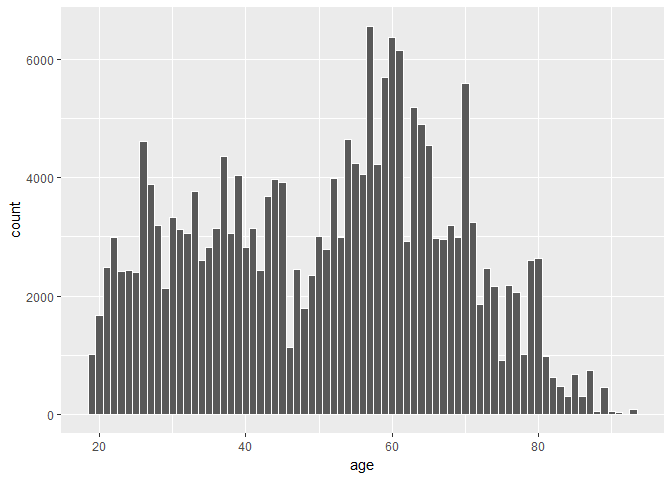

Did You Vote? Complete
================

``` r
vote16 <- read_csv("data/CCES16.csv")
```

    ## Parsed with column specification:
    ## cols(
    ##   weight = col_double(),
    ##   inputstate = col_integer(),
    ##   votereg = col_integer(),
    ##   age = col_integer(),
    ##   party_ID = col_integer(),
    ##   askvote = col_integer(),
    ##   vote_method = col_integer()
    ## )

``` r
#making a vote column
vote16complete <- mutate(vote16, voted = ifelse(askvote %in% 1:4,"no",
                                            ifelse(askvote %in% 5, "yes",  "NAorMissing" ))) %>%

  #making a party column
  mutate(party = ifelse(party_ID %in% 1,"Democrat",
ifelse(party_ID %in% 2, "Republican", 
ifelse(party_ID %in% 3, "Independent",
ifelse(party_ID %in% 4, "Other",  "NAorMissing" ))))) %>%

  # making a registered column

  mutate(registered = ifelse(votereg %in% 1, "Yes", 
                                                                           ifelse(votereg %in% 2, "No", 
        ifelse(votereg %in% 3, "DontKnow", "NAorMissing"
                                    )))) %>%
  
#vote method method
  mutate(method_vote = ifelse(vote_method %in% 1, "In person on election day", 
                              ifelse(vote_method %in% 2, "In person early", 
                              ifelse(vote_method %in% 3, "Voted by mail or absentee", "Dontknow_skipped_notasked"
                              )))) %>% select(weight, age, voted, party, registered, method_vote)
```

``` r
vote16_noNA <- vote16complete %>% filter(registered == "Yes") %>% 
  select(-registered)

vote16_noNA <- vote16_noNA %>% 
  mutate(wtd = round(weight * 100))

vote16_long <- vote16_noNA %>% 
  mutate(ids = map(wtd, seq_len)) %>% 
  unnest()
write_csv(vote16_long, "data/vote16_long.csv")
```

``` r
vote16_long %>% 
  ggplot(aes(x = age)) +
  geom_histogram(color = "white", binwidth = 1)
```



``` r
vote14 <- read_csv("data/CCES14.csv")
```

    ## Parsed with column specification:
    ## cols(
    ##   weight = col_double(),
    ##   StateAbbr = col_character(),
    ##   age = col_integer(),
    ##   votereg = col_integer(),
    ##   party_ID = col_integer(),
    ##   askvote = col_integer(),
    ##   vote_method = col_integer()
    ## )

``` r
#making a vote column
vote14complete <- mutate(vote14, voted = ifelse(askvote %in% 1:4,"no",
                                            ifelse(askvote %in% 5, "yes",  "NAorMissing" ))) %>%
  
#making a party column
  mutate(party = ifelse(party_ID %in% 1,"Democrat",
ifelse(party_ID %in% 2, "Republican", 
ifelse(party_ID %in% 3, "Independent",
ifelse(party_ID %in% 4, "Other",  "NAorMissing" ))))) %>%

  # making a registered column

  mutate(registered = ifelse(votereg %in% 1, "Yes", 
                                                                           ifelse(votereg %in% 2, "No", 
        ifelse(votereg %in% 3, "DontKnow", "NAorMissing"
                                    )))) %>%
  
#vote method method
  mutate(method_vote = ifelse(vote_method %in% 1, "In person on election day", 
                              ifelse(vote_method %in% 2, "In person early", 
                              ifelse(vote_method %in% 3, "Voted by mail or absentee", "Dontknow_skipped_notasked"
                              )))) %>%
#remove old columns
select(weight, age, voted, party, registered, method_vote)
```

``` r
vote12 <- read_csv("data/CCES12.csv")
```

    ## Parsed with column specification:
    ## cols(
    ##   weight = col_double(),
    ##   StateAbbr = col_character(),
    ##   age = col_integer(),
    ##   votereg = col_integer(),
    ##   askvote = col_integer(),
    ##   party_ID = col_integer(),
    ##   vote_method = col_integer()
    ## )

``` r
#making a vote column
vote12complete <- mutate(vote12, voted = ifelse(askvote %in% 1:4,"no",
                                            ifelse(askvote %in% 5, "yes",  "NAorMissing" ))) %>%
  
#making a party column
  mutate(party = ifelse(party_ID %in% 1,"Independent",
ifelse(party_ID %in% 2, "Democrat", 
ifelse(party_ID %in% 3, "Republican",
ifelse(party_ID %in% 4, "Other",  "NAorMissing" ))))) %>%

  # making a registered column

  mutate(registered = ifelse(votereg %in% 1, "Yes", 
                                                                           ifelse(votereg %in% 2, "No", 
        ifelse(votereg %in% 3, "DontKnow", "NAorMissing"
                                    )))) %>%
  
#vote method method
  mutate(method_vote = ifelse(vote_method %in% 1, "In person on election day", 
                              ifelse(vote_method %in% 2, "In person early", 
                              ifelse(vote_method %in% 3, "Voted by mail or absentee", "Dontknow_skipped_notasked"
                              )))) %>%
#remove old columns
select(weight, age, voted, party, registered, method_vote)
```

``` r
write_csv(vote16complete, "data/CCES_vote16.csv")
write_csv(vote14complete, "data/CCES_vote14.csv")
write_csv(vote12complete, "data/CCES_vote12.csv")
```
