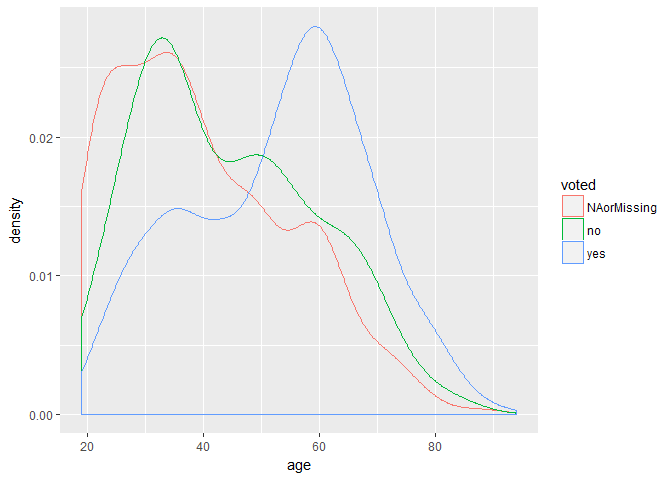

completing the CCES cleanup
================

Scroll all the way to the bottom thats where it gets good
---------------------------------------------------------

#### (the last chunk combines everything in the first few chunks)

``` r
vote16 <- read_csv("data/CCES16.csv")
```

    ## Parsed with column specification:
    ## cols(
    ##   weight = col_double(),
    ##   inputstate = col_integer(),
    ##   votereg = col_integer(),
    ##   age = col_integer(),
    ##   party_ID = col_integer(),
    ##   askvote = col_integer(),
    ##   vote_method = col_integer()
    ## )

``` r
#making a vote y/n option
# according to the CCES key 1-4 indicate not voting, 5 indicates voted, 8&9 indicate skipped and not asked

vote16vote <- mutate(vote16, voted = ifelse(askvote %in% 1:4,"no",
                                            ifelse(askvote %in% 5, "yes",  "NAorMissing" )))
table(vote16vote$voted)
```

    ## 
    ## NAorMissing          no         yes 
    ##         594         151        1953

``` r
#this works, but the data itself does not conform to the key provided. There is supposed to be an 8 for Skipped and a 9 for Not Asked but the dataframe has NAs instead. In fact there are no 8s or 9s in the set
table(vote16$askvote)
```

    ## 
    ##    1    2    3    4    5 
    ##   79   22   31   19 1953

``` r
vote16vote_party <- mutate(vote16vote, party = ifelse(party_ID %in% 1,"Democrat",
ifelse(party_ID %in% 2, "Republican", 
ifelse(party_ID %in% 3, "Independent",
ifelse(party_ID %in% 4, "Other",  "NAorMissing" )))))

#how does it look
table(vote16vote_party$party)
```

    ## 
    ##    Democrat Independent NAorMissing       Other  Republican 
    ##         915         631         432         103         617

``` r
table(vote16$party_ID)
```

    ## 
    ##   1   2   3   4 
    ## 915 617 631 103

``` r
vote16vote_party_reg <- mutate(vote16vote_party, registered = ifelse(votereg %in% 1, "Yes", 
                                                                           ifelse(votereg %in% 2, "No", 
        ifelse(votereg %in% 3, "DontKnow", "NAorMissing"
                                    ))))
```

``` r
#rewriting this terrible code to be more succicinct (intentionally mispelled thats the joke)

#this should pull directly from the github csv

#making a vote column
vote16complete <- mutate(vote16, voted = ifelse(askvote %in% 1:4,"no",
                                            ifelse(askvote %in% 5, "yes",  "NAorMissing" ))) %>%
  
#making a party column
  mutate(party = ifelse(party_ID %in% 1,"Democrat",
ifelse(party_ID %in% 2, "Republican", 
ifelse(party_ID %in% 3, "Independent",
ifelse(party_ID %in% 4, "Other",  "NAorMissing" ))))) %>%

  # making a registered column

  mutate(registered = ifelse(votereg %in% 1, "Yes", 
                                                                           ifelse(votereg %in% 2, "No", 
        ifelse(votereg %in% 3, "DontKnow", "NAorMissing"
                                    )))) %>%
  
#vote method method
  mutate(method_vote = ifelse(vote_method %in% 1, "In person on election day", 
                              ifelse(vote_method %in% 2, "In person early", 
                              ifelse(vote_method %in% 3, "Voted by mail or absentee", "Dontknow_skipped_notasked"
                              )))) %>%
#remove old columns
select(1, 4, 8:11)

head(vote16complete)
```

    ## # A tibble: 6 x 6
    ##       weight   age voted       party registered               method_vote
    ##        <dbl> <int> <chr>       <chr>      <chr>                     <chr>
    ## 1 1.05306953    25   yes    Democrat        Yes Voted by mail or absentee
    ## 2 0.50055321    58   yes Independent        Yes In person on election day
    ## 3 0.98049887    81   yes  Republican        Yes In person on election day
    ## 4 0.09183999    30   yes       Other        Yes Voted by mail or absentee
    ## 5 0.65328433    50   yes    Democrat        Yes Voted by mail or absentee
    ## 6 0.47995006    30    no    Democrat        Yes Dontknow_skipped_notasked

``` r
ggplot(vote16complete, aes(age, col = voted)) + geom_density()
```


