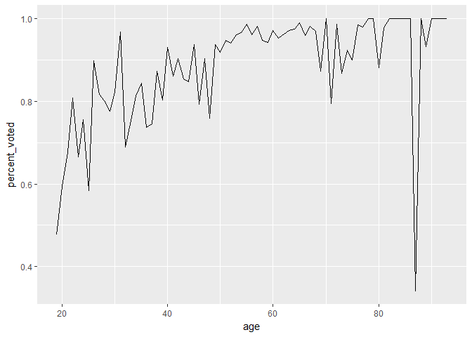

Visualizations
================

``` r
viz16 <- read_csv("data/vote16_long.csv")
```

    ## Parsed with column specification:
    ## cols(
    ##   weight = col_double(),
    ##   age = col_integer(),
    ##   voted = col_character(),
    ##   party = col_character(),
    ##   method_vote = col_character(),
    ##   wtd = col_integer(),
    ##   ids = col_integer()
    ## )

``` r
smallviz16 <- viz16 %>% select(age, voted) %>% group_by(age) %>% summarize(percent_voted = mean(voted == "yes"))
write_csv(smallviz16, "data/smallviz16.csv")
ggplot(smallviz16, aes(x = age, y = percent_voted)) + geom_line()
```


