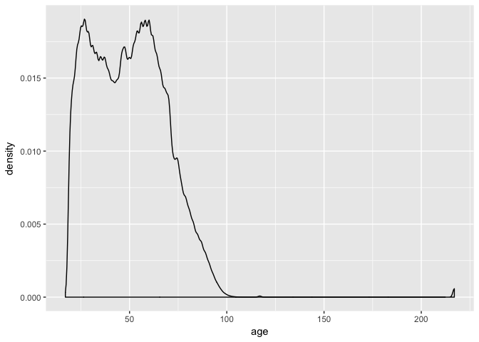
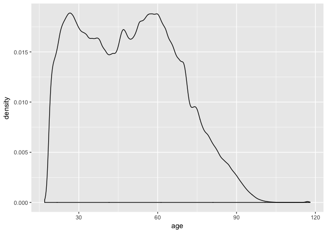

Messing\_with\_age\_Carter
================

adding an age variable
----------------------

``` r
# make sure Ohio_df_lite.csv is in Downloads

Ohio_df_lite <- read_csv("~/Downloads/Ohio_df_lite.csv", na = c("", "NA"))
```

    ## Warning: Missing column names filled in: 'X1' [1]

    ## Parsed with column specification:
    ## cols(
    ##   X1 = col_integer(),
    ##   SOS_VOTERID = col_character(),
    ##   COUNTY_ID = col_character(),
    ##   DATE_OF_BIRTH = col_date(format = ""),
    ##   REGISTRATION_DATE = col_date(format = ""),
    ##   VOTER_STATUS = col_character(),
    ##   PARTY_AFFILIATION = col_character(),
    ##   RESIDENTIAL_CITY = col_character(),
    ##   RESIDENTIAL_STATE = col_character(),
    ##   `PRIMARY-03/06/2012` = col_character(),
    ##   `GENERAL-11/06/2012` = col_character(),
    ##   `PRIMARY-05/06/2014` = col_character(),
    ##   `GENERAL-11/04/2014` = col_character(),
    ##   `PRIMARY-03/15/2016` = col_character(),
    ##   `GENERAL-06/07/2016` = col_character(),
    ##   `PRIMARY-09/13/2016` = col_character(),
    ##   `GENERAL-11/08/2016` = col_character()
    ## )

``` r
#mutate to make an age variable

Ohio_df_lite <- mutate(Ohio_df_lite, age = 2017 - year(DATE_OF_BIRTH))

#I checked the df using unique. I see age 18 and 19 which is a good sign. I see some 137, 135, and 132 year olds which is bad.

unique(Ohio_df_lite$age)
```

    ##   [1]  60  66  56  88  33  93  77  70  67  81  37  44  80  39  34  73  59
    ##  [18]  58  57  91  86  64  68  47  82  36  62  41  87  35  45  55  61  74
    ##  [35]  89  31  90  63  28  54  32  29  25  49  22  26  71  42  23  46  53
    ##  [52]  27  30  19  20  48  51  52  76  50  65  40  79  69  96  72  43  38
    ##  [69]  24  21  75  92  78  85  83  99  94  84  97  18  95 217 103 101  98
    ##  [86] 102 104 100 118 114 117 105 116 109 107 112 106 111 108 110 113 115
    ## [103]  17 137 132 131 135

``` r
#gonna filter out everyone above 140
Ohio_under120 <- filter(Ohio_df_lite, age < 120)

#to make a list of everyone over 120 (and try and fix it) unhash this
#Ohio_over120 <- filter(Ohio_df_lite, age > 120)
```

``` r
#i want to see how age is distributed, before and after removing the roughly 8000 people over the age of 140
#full set
ggplot(Ohio_df_lite, aes(age)) + geom_density(kernel = "gaussian")
```



``` r
#under 140
ggplot(Ohio_under120, aes(age)) + geom_density(kernel = "gaussian")
```


